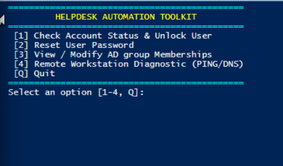
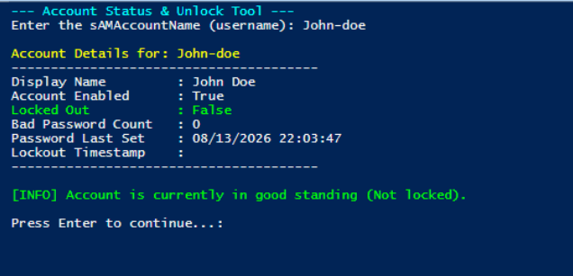
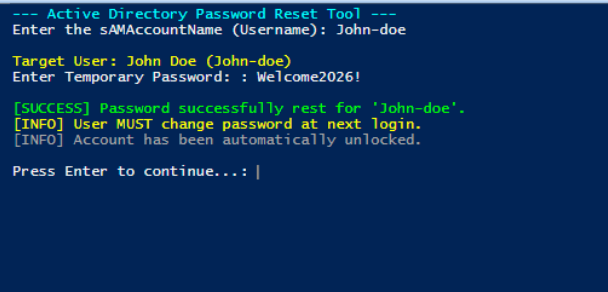
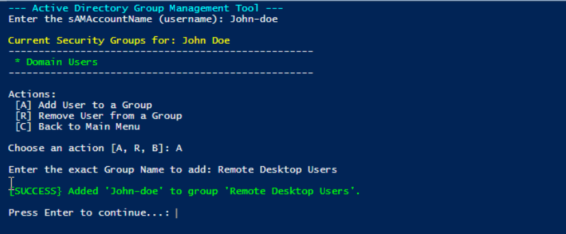
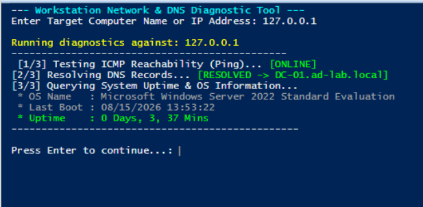

# PowerShell IT Support & Helpdesk Automation Toolkit

An interactive, modular PowerShell administration utility designed for Tier 1 and Tier 2 IT support technicians. This tool streamlines repetitive Active Directory identity tasks, account lifecycle management, and first-hop network diagnostics into a single menu-driven console with built-in error handling and input sanitization.

---

## Technical Overview & Features

* **Account Diagnostics & Lockout Triage:** Queries Active Directory extended attributes (`LockedOut`, `BadLogonCount`, `PasswordLastSet`, `AccountLockoutTime`) and unlocks accounts dynamically.
* **Administrative Credential Reset:** Enforces password rotation by taking plain text input, converting to an encrypted `.NET` `SecureString`, applying `Set-ADAccountPassword`, and setting `ChangePasswordAtLogon = $true`.
* **RBAC & Group Membership Governance:** Queries existing security group assignments and automates `Add-ADGroupMember` / `Remove-ADGroupMember` operations.
* **First-Hop Endpoint Diagnostics:** Tests ICMP connectivity, verifies forward/reverse DNS resolution records via `Resolve-DnsName`, and queries remote host uptime via WMI/CIM (`Win32_OperatingSystem`).
* **Fault-Tolerant Architecture:** Implements non-terminating error suppression with structured `try/catch` exception blocks and checks for mandatory local administrative elevation upon launch.

---

## Architectural Workflow

```text
  +--------------------------------------------------------------------------+
  |                   HELPDESK AUTOMATION TOOLKIT (CLI)                      |
  |                        Helpdesk-Toolkit.ps1                              |
  +-------------------------------------+------------------------------------+
                                        |
                   +--------------------+--------------------+
                   |                                         |
                   v                                         v
  +----------------------------------+     +----------------------------------+
  |     ACTIVE DIRECTORY ENGINE      |     |       NETWORK & WMI ENGINE       |
  |   (ActiveDirectory RSAT Module)  |     |      (CIM / DNS / ICMP APIs)     |
  +-----------------+----------------+     +-----------------+----------------+
                    |                                        |
         +----------+----------+                  +----------+----------+
         |                     |                  |                     |
         v                     v                  v                     v
  +--------------+      +--------------+   +--------------+      +--------------+
  | User Lockout |      | Group RBAC   |   | ICMP / Ping  |      | Remote CIM   |
  | & Cred Reset |      | Management   |   | & DNS Lookup |      | Host Uptime  |
  +--------------+      +--------------+   +--------------+      +--------------+
```

---

## Tool Demonstration & Visual Evidence

### 1. Central Technician Console
The interactive console provides a standardized menu interface, ensuring consistent script execution across support tiers.

<p align="center">
  
  <br>
  <em>Figure 1.1: Interactive administrative menu interface with input routing and execution loop.</em>
</p>

---

### 2. User Account Inspection & Lockout Remediation
The tool checks for account existence, pulls extended domain properties, and evaluates the bad password count to provide context before offering an immediate unlock prompt.

<p align="center">
  
  <br>
  <em>Figure 2.1: Extended Active Directory attribute query displaying healthy account state and last password timestamps.</em>
</p>

---

### 3. Password Reset & Mandatory Rotation Enforcement
Passes credentials safely into the domain using `ConvertTo-SecureString`, forces user-side password changes upon next logon, and automatically clears stale lockout flags.

<p align="center">
  
  <br>
  <em>Figure 3.1: Password reset pipeline executing credential rotation and setting ChangePasswordAtLogon.</em>
</p>

---

### 4. Group Membership Management (RBAC)
Queries group memberships and handles additions/removals to ensure least-privilege access and faster ticket turnaround for access requests.

<p align="center">
  
  <br>
  <em>Figure 4.1: Live security group query and addition of the target user to 'Remote Desktop Users'.</em>
</p>

---

### 5. Remote Workstation Network Diagnostics
Automates basic network isolation steps by testing physical reachability, verifying name resolution, and pulling OS metrics via CIM.

<p align="center">
  
  <br>
  <em>Figure 5.1: Multi-stage network diagnostic verifying ICMP response, DNS mapping, and system uptime.</em>
</p>

---

## Script Execution & Installation

### Prerequisites
* Windows 10/11 Enterprise or Windows Server 2019/2022.
* PowerShell 5.1 or PowerShell 7+.
* Remote Server Administration Tools (RSAT) with Active Directory Module installed:
  ```powershell
  # Install Active Directory module on Windows 10/11 (Run as Administrator)
  Add-WindowsCapability -Online -Name "Rsat.ActiveDirectory.DS-LDS.Tools~~~~0.0.1.0"
  ```

### Running the Utility
```powershell
# Clone the repository
git clone [https://github.com/](https://github.com/)<YourUsername>/powershell-helpdesk-automation-toolkit.git

# Navigate to directory
cd powershell-helpdesk-automation-toolkit

# Execute with elevated privileges
powershell.exe -ExecutionPolicy Bypass -File .\Helpdesk-Toolkit.ps1
```

---

## Error Handling & Reliability Engineering

| Condition | Potential Impact | Script Mitigation |
| :--- | :--- | :--- |
| **Missing AD Object** | Script crashes with red exception trace | Handled via `try/catch` with `-ErrorAction Stop`, outputting a clean warning |
| **Blank User Input** | Cmdlet throws parameter binding error | Validated using `[string]::IsNullOrWhiteSpace($input)` before processing |
| **Plaintext Password Rejection** | Active Directory API rejects unencrypted strings | Input transformed using `ConvertTo-SecureString -AsPlainText -Force` |
| **Unresponsive Remote Host** | Script hangs indefinitely waiting on RPC/WMI | CIM queries configured with a strict 3-second timeout (`-OperationTimeoutSec 3`) |
| **Non-Elevated Session** | Privilege errors during AD modifications | Validates `[Security.Principal.WindowsBuiltInRole]::Administrator` on load |
